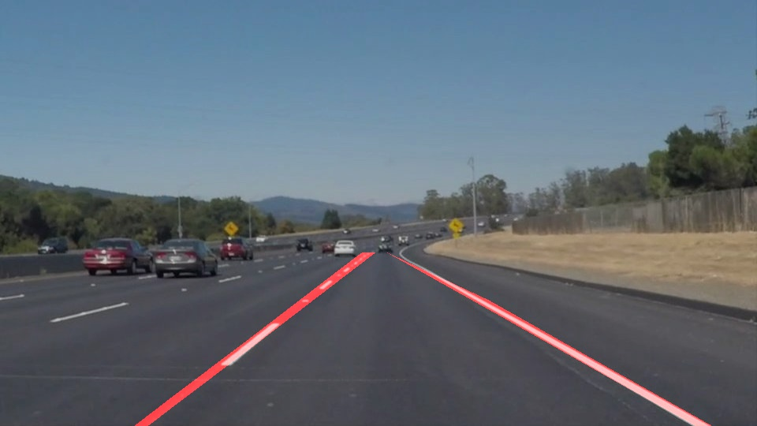

# **Finding Lane Lines on the Road** 

## Writeup Template

### You can use this file as a template for your writeup if you want to submit it as a markdown file. But feel free to use some other method and submit a pdf if you prefer.

---

**Finding Lane Lines on the Road**

The goals / steps of this project are the following:
* Make a pipeline that finds lane lines on the road
* Reflect on your work in a written report

---

### Reflection

### 1. My pipeline and draw_lines() function.

My lane detection pipeline consisted of the following steps:
1. Change the image to grayscale to reduce the information.
2. Apply Gaussian smoothing to blur the edges of the grayscale image.
3. Determine the Otsu threshold of the image and use it to run Canny edge detection on the blurred image.
4. Mask the region of interest to eliminate the sky and the peripheral objects.
5. Run the Hough transform to determine the lines within the ROI.
6. Rerun the ROI mask to remove extrapolated line data outside of the region.
7. If in testing, visually confirm the placement of the lines

In order to draw a single line on the left and right lanes, I modified the draw_lines() function by separating then collecting the data points using the slope of the lines.  I then used the polyfit function to calculate the best fit line, which was drawn on the parameterized image.

### 2. Identify potential shortcomings with your current pipeline

This method suffers from numerous shortcomings:
- The extrapolation method draws incorrect lane markers with larger breaks in the lines or sharper curves.  Correcting to a higher order polynomial might help but would introduce error with straight lines.
- The region of interest is arbitrary.  Indeed, with the different camera position and field of view used for the challenge video, the ROI mask breaks down.
- The six pipeline steps would need to be heavily optimized to run real-time in a vehicle.

### 3. Suggest possible improvements to your pipeline

A possible improvement would be to use a camera with known characteristics in a fixed position.  This information would feed into a calculation of the region of interest.  In addition, a running calculation of the width of the lane could be used to set boundary conditions for restricting lane placement.
