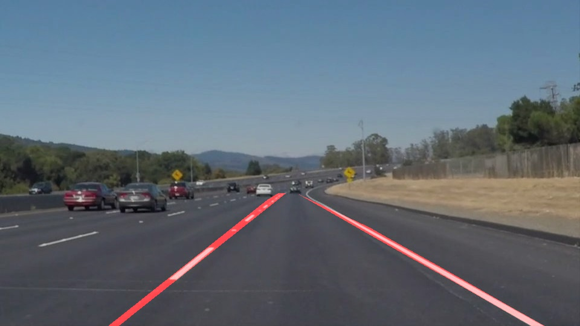

# **Finding Lane Lines on the Road** 

## Writeup Template

### You can use this file as a template for your writeup if you want to submit it as a markdown file. But feel free to use some other method and submit a pdf if you prefer.

---

**Finding Lane Lines on the Road**

The goals / steps of this project are the following:
* Make a pipeline that finds lane lines on the road
* Reflect on your work in a written report

---

### Reflection

### 1. My pipeline and draw_lines() function.

My lane detection pipeline consisted of the following steps:
1. Change the image to grayscale to reduce the information.
2. Apply Gaussian smoothing to blur the edges of the grayscaled image.
3. Run Canny edge detection on the blurred image.
4. Mask the region of interest to elimate the sky and the peripheral objects.
5. Run the Hough transform to determine the lines within the ROI.
6. If in testing, visually confirm the placement of the lines

In order to draw a single line on the left and right lanes, I modified the draw_lines() function by ...

### 2. Identify potential shortcomings with your current pipeline

One potential shortcoming would be what would happen when ... 

Another shortcoming could be ...

### 3. Suggest possible improvements to your pipeline

A possible improvement would be to ...

Another potential improvement could be to ...
